# Plot Demos
> 一些使用 Python 绘图的脚本

## Line Plot
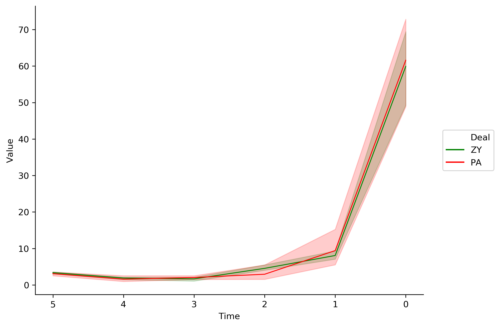

```python
python line.py -i line.data -x Time -y Value --hue Deal --size 8,6 --order 5,4,3,2,1,0 --colors red,green -p line
```

[脚本路径](line/line.py)


## Scatter Plot
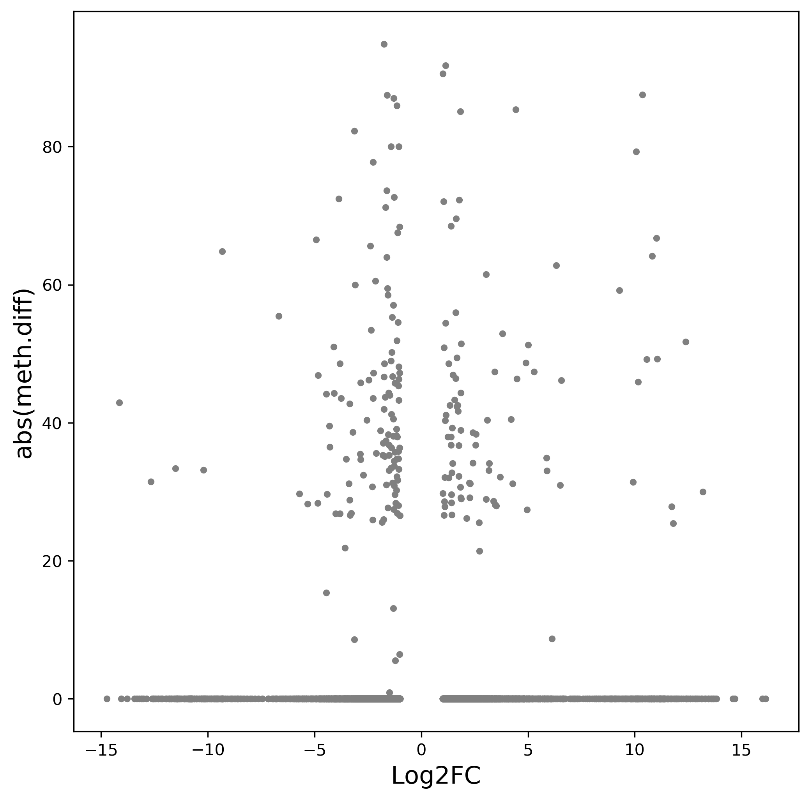

```python
python scatter -i scatter.data --xname RNA_log2FC --yname Meth_diff -x Log2FC -y 'abs(meth.diff)' -p scatter
```

[脚本路径](scatter/scatter.py)

[数据路径1](scatter/scatter.data)


## Bar Plot
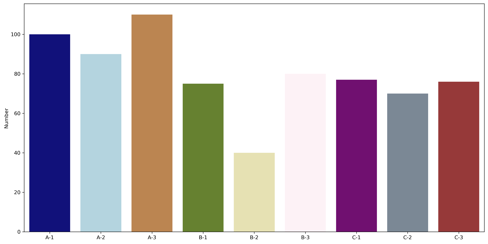

```python
python bar.py -i bar.data -g group.txt --xname Sample --yname Number -y Number

# With Hue
python bar.py -i bar_hue.data --xname region --yname number --huename 'type' --hueorder hyper,hypo --color red,green
```

[脚本路径](bar/bar.py)

[数据路径1](bar/bar.data)

[数据路径2](bar/group.txt)

### Two Levle Bar plot
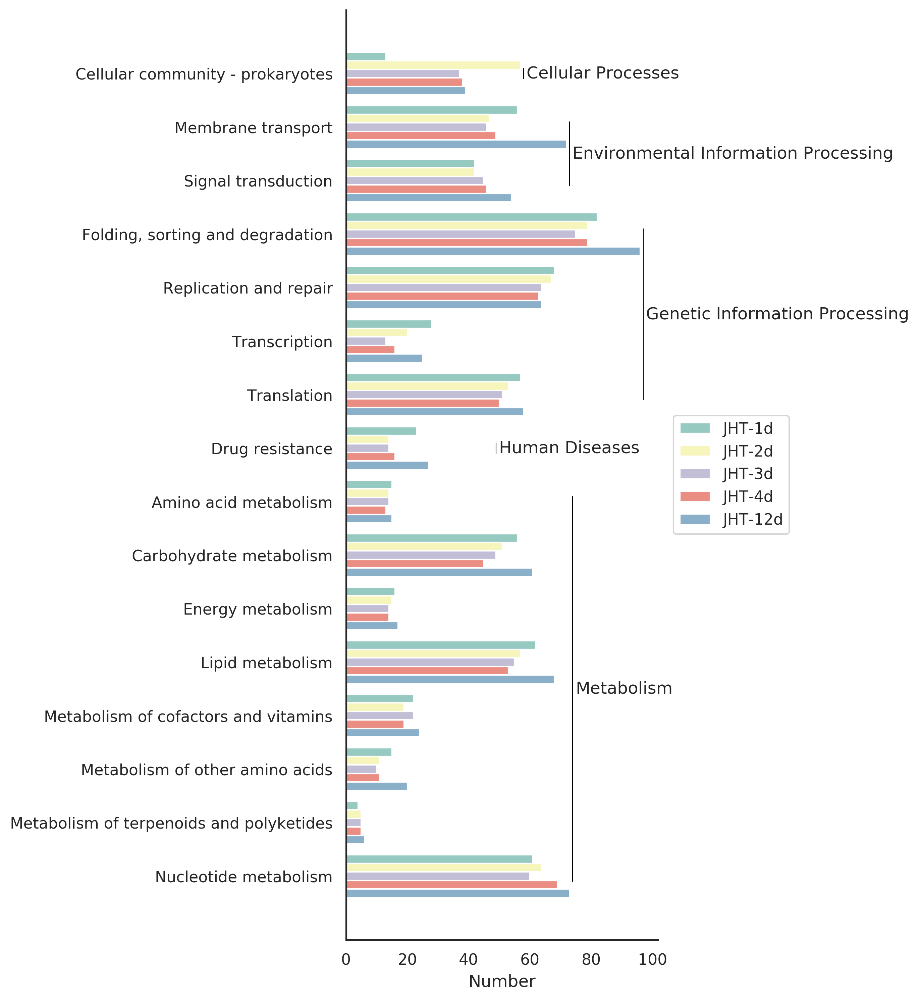

```python
python two_level.py -i two_level.data --xname Number --huename Group -p two_level
```
[脚本路径](bar/two_level.py)

[数据路径1](bar/two_level.data)

### Population Pyramid Plot
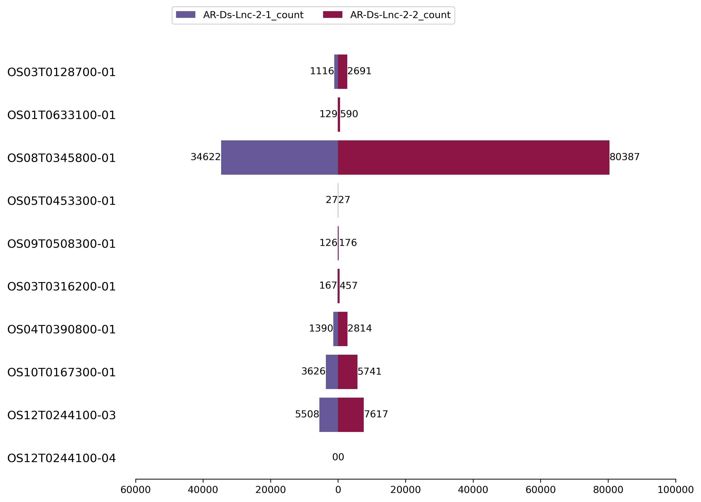
```python
python /Bio/User/renchaobo/Scripts/PopulationPyramidPlot.py -i PopulationPyramidPlot.data -ic 0 -lc 1 -rc 2 -p PopulationPyramidPlot 
```


## Box Plot
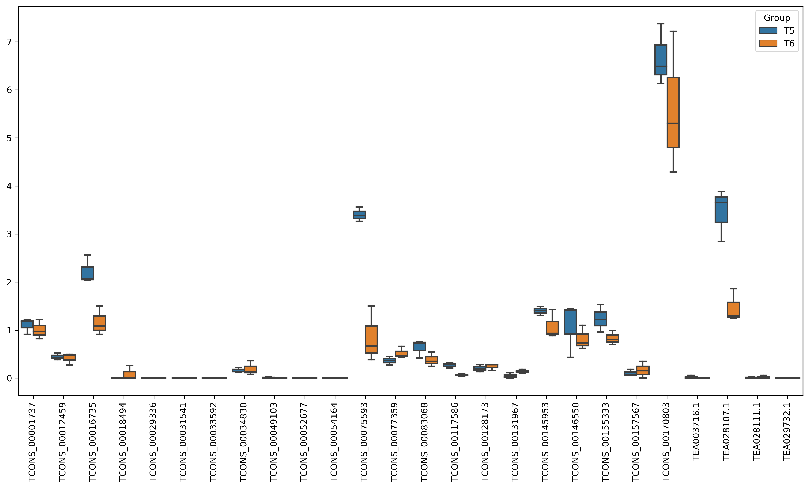

```python
python box.py -i box.data --xname Gene --yname Exp --huename Group --xrotation 90 -p box
```

[脚本路径](box/box.py)

[数据路径](box/box.data)

## Pie Plot
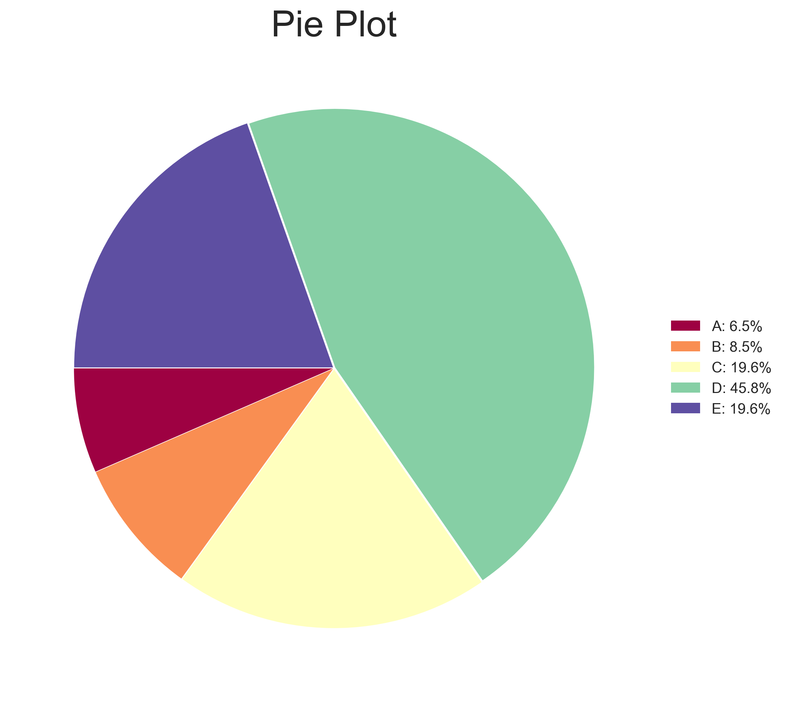

```python
python pie.py -i pie.data --name Name --number Number --plot_type percent -t "Pie Plot" -p pie
```

[脚本路径](pie/pie.py)

[数据路径](pie/pie.data)

## Violin Plot
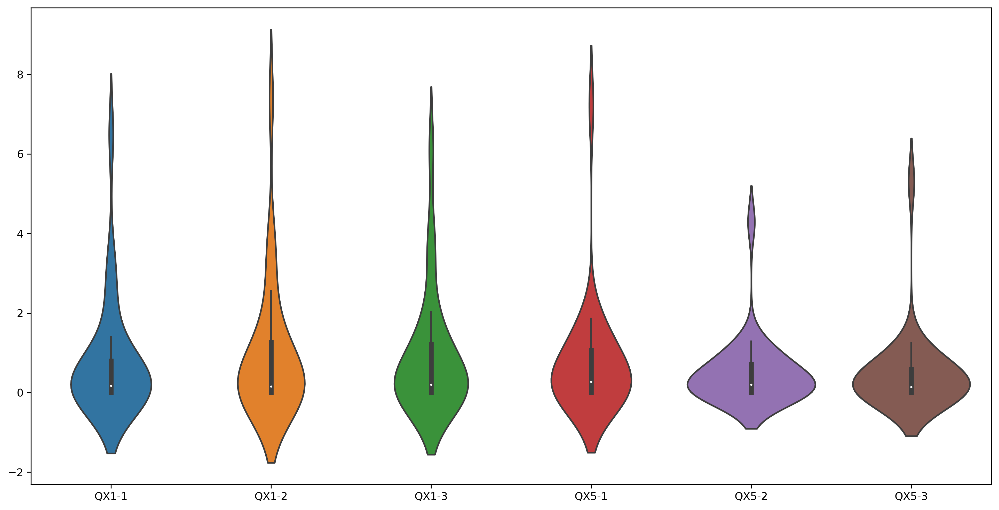

```python
-i violin.data --xname Sample --yname Exp -p violin
```

[脚本路径](violin/violin.py)

[数据路径](violin/violin.data)

## Density Plot
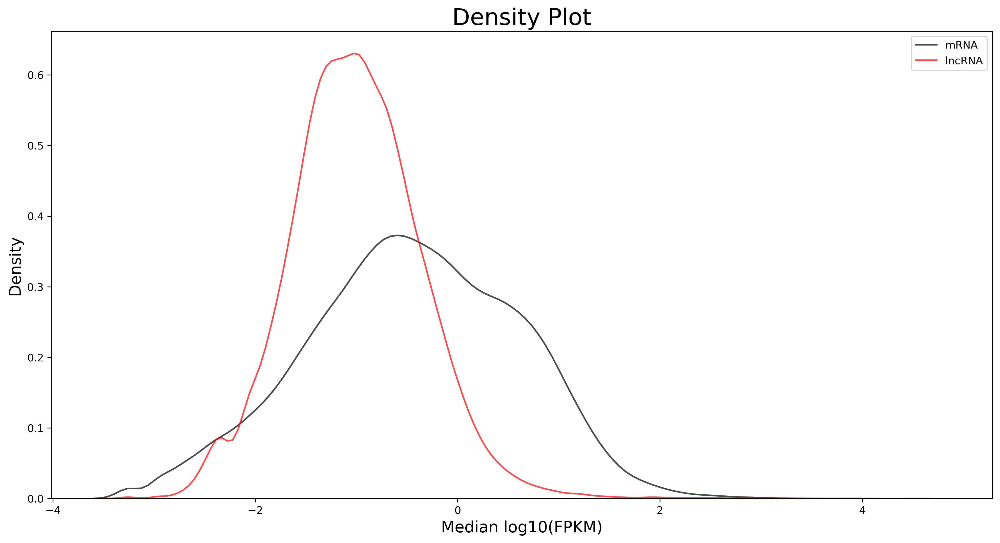

```python
python density.py -i density.data -n mRNA,lncRNA -p density -y Density -x "Median log10(FPKM)" -t "Density Plot" -c "black,red"
```

[脚本路径](density/density.py)

[数据路径](density/density.data)

## Stack Plot
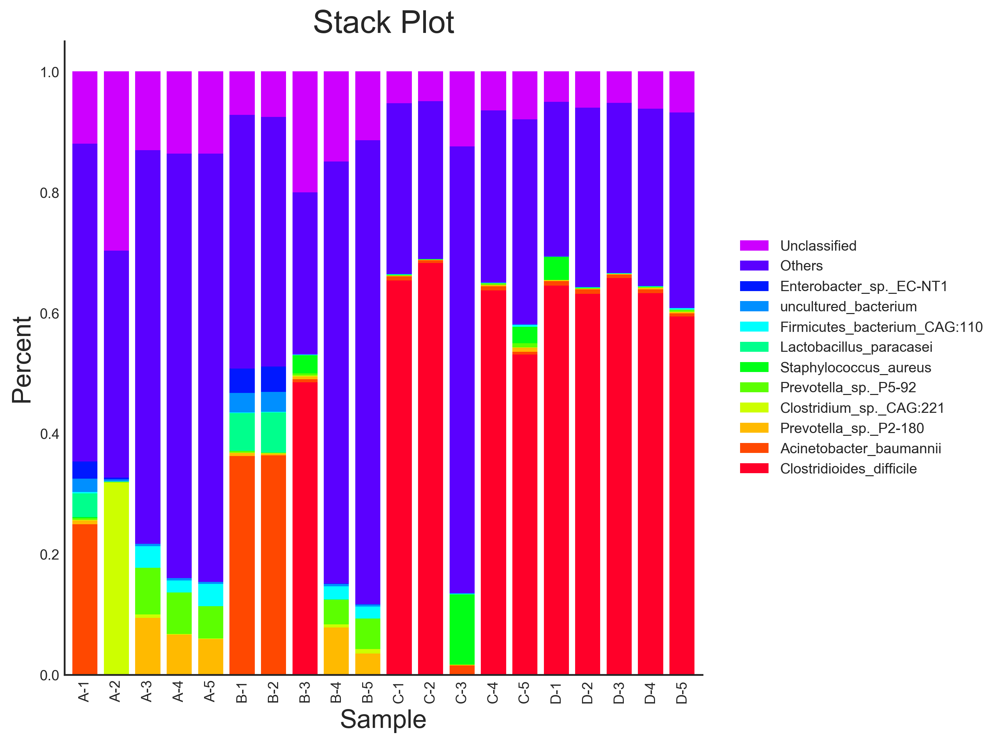

```python
python stack.py -i stack.data -x Sample -y Percent -t "Stack Plot" -p stack
```

[脚本路径](stack/stack.py)

[数据路径](stack/stack.data)

## volcano plot
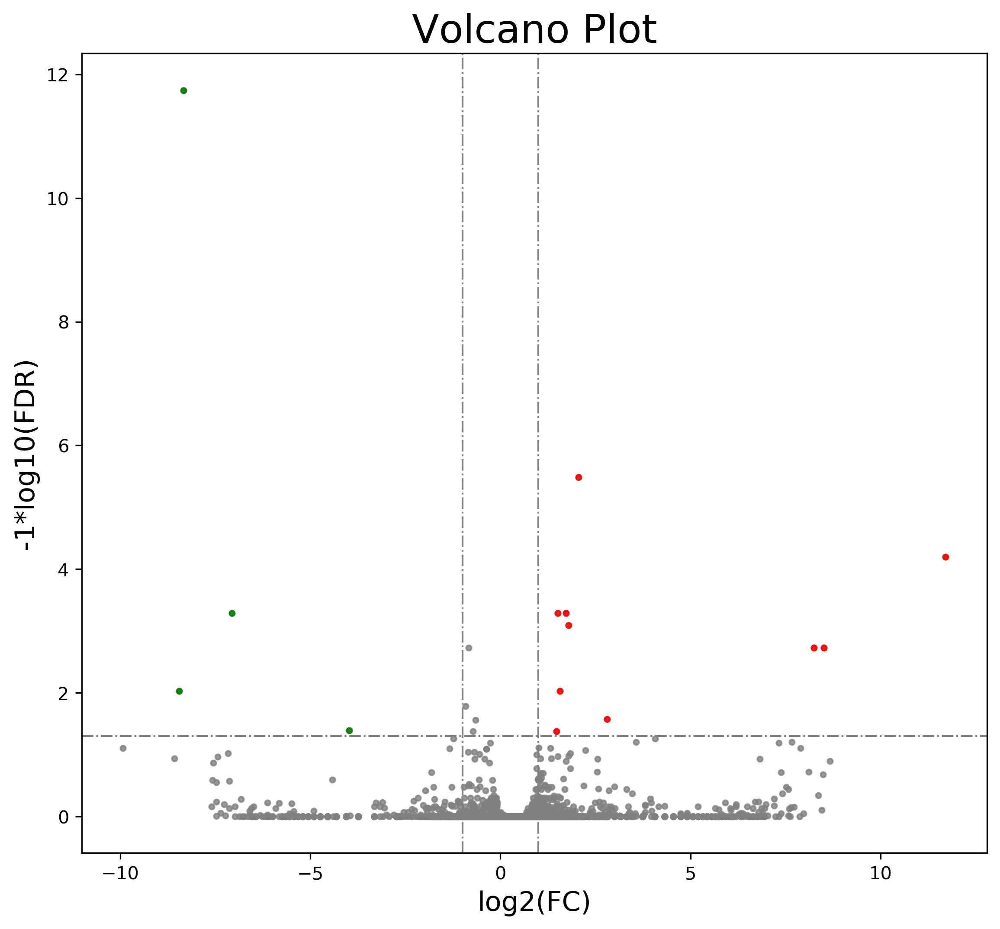

```python
python volcano.py -i volcano.data -p volcano
# 加入tag
python volcano.py -i volcano.data --annot tag.txt -p volcano.tag
```

[脚本路径](volcano/volcano.py)

[数据路径](volcano/volcano.data)

[数据路径](volcano/tag.txt)

## Mix Plot
多种类型图片的混合
### box_rectangle Plot
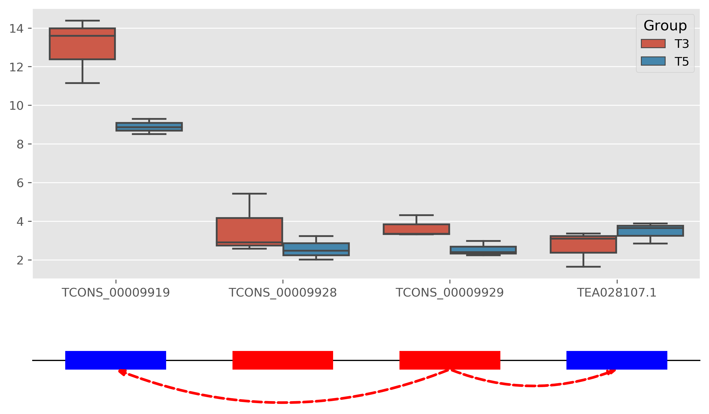
```python
python box_rectangle.py -i box_rectangle.data -r box_rectangle.pearson --xname Gene --yname Exp --huename Group --xorder TCONS_00009919,TCONS_00009928,TCONS_00009929,TEA028107.1 -p box_rectangle
```

[脚本路径](mix/box_rectangle.py)

[数据路径1](mix/box_rectangle.data)

[数据路径2](mix/box_rectangle.pearson)

### buble plot
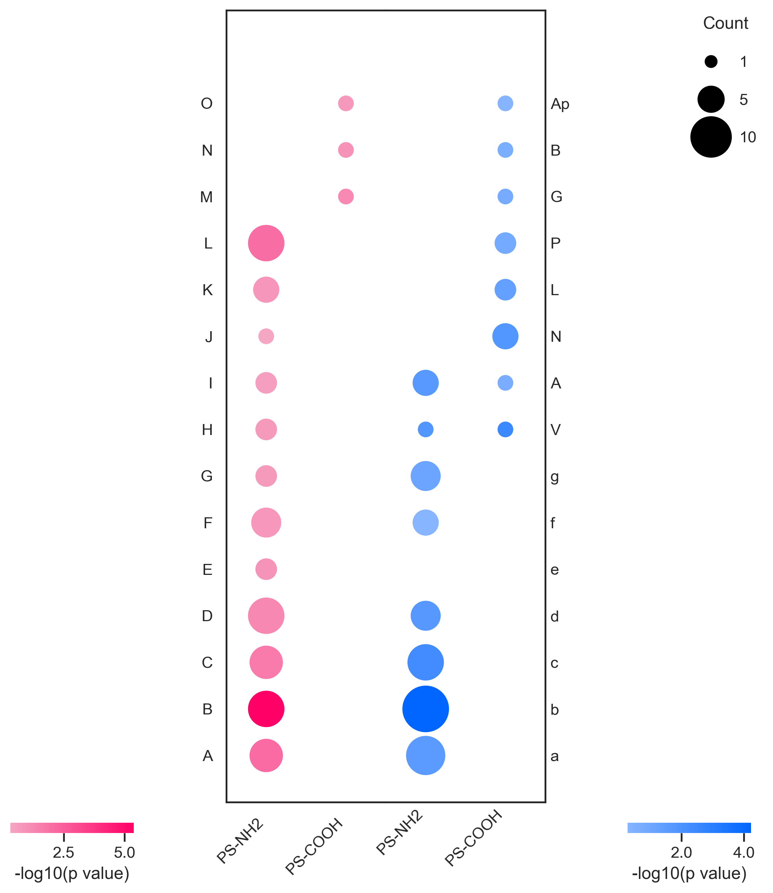
```python
python bubble.py --up bubble_UP.tsv --down bubble_DOWN.tsv -p bubble
```
[脚本路径](mix/bubble.py)

[数据路径1](mix/bubble_UP.tsv)

[数据路径2](mix/bubble_DOWN.tsv)


